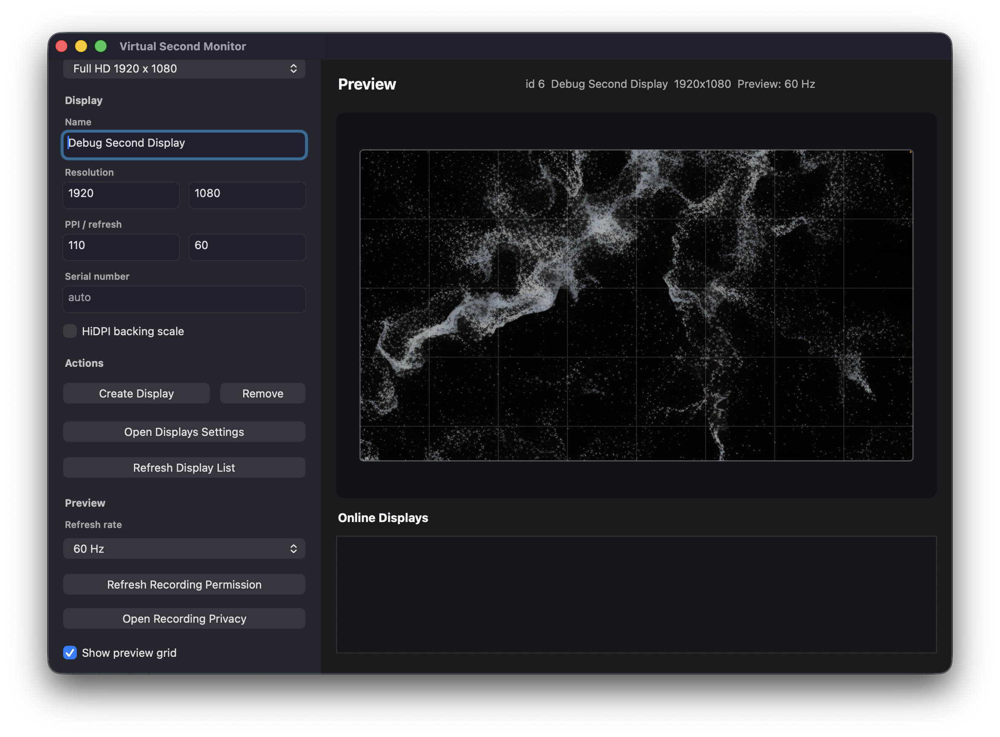
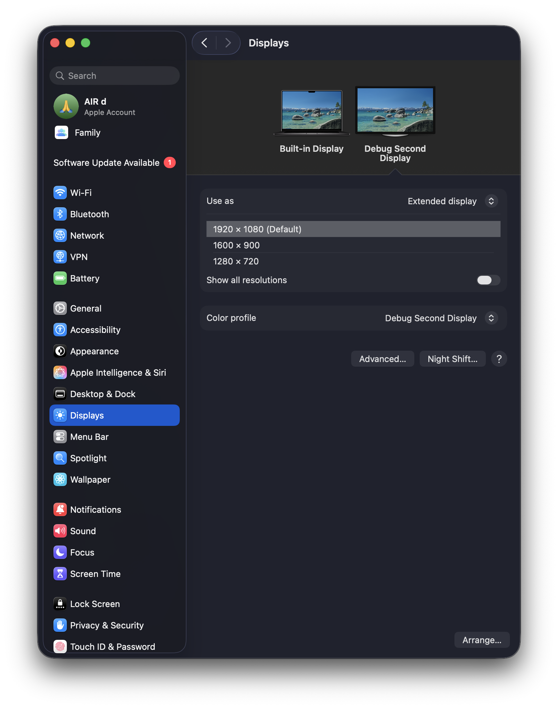

# Virtual Second Monitor for macOS

Virtual Second Monitor is a small macOS app that creates up to eight OS-recognized virtual monitors without attaching external displays.

It is designed for rehearsing and debugging multi-display workflows before a live setup. When a real projector, LED processor, capture card, or external display is not available, this app lets you verify second-screen behavior in advance: window placement, fullscreen output, 4K/8K layout assumptions, preview behavior, and display enumeration.

## Why

Live and installation work often depends on a second display, but the actual display hardware is not always available during development. This tool makes that gap easier to handle:

- Test multi-display output with up to eight virtual monitors before arriving at a venue.
- Check fullscreen behavior without connecting an external monitor.
- Verify that apps detect an additional display through macOS.
- Rehearse 4K and 8K output paths from a laptop-only setup.
- Preview the virtual display while keeping the workflow self-contained.

## 日本語での目的

外付けディスプレイ、プロジェクター、LED プロセッサーなどが手元にない状態でも、macOS が認識する仮想ディスプレイを最大8台同時に作成できます。各ディスプレイに異なる名前・解像度・リフレッシュレートを設定でき、一覧から選んでプレビューや個別削除ができます。ライブや展示の前に、出力先の検出、フルスクリーン表示、解像度設定、4K/8K レイアウト、プレビュー確認を事前にテストできるようにするためのツールです。

## Screenshots

Earlier single-monitor app interface (the current app adds a monitor list above the preview):



Virtual display shown in macOS Displays settings:



## Features

- Creates up to eight simultaneous macOS-recognized virtual monitors using `CGVirtualDisplay`.
- Native AppKit monitor list with a count, selection, individual removal, and Remove All.
- Adding a monitor preserves existing monitors; the Add button disables at eight and enables again after removal.
- Automatic unique serial numbers; duplicate explicit serials are rejected without changing existing monitors.
- Presets for FHD, QHD, WUXGA, portrait, 4K UHD, 5K Retina, and 8K UHD.
- Manual width, height, PPI, refresh rate, display name, and serial fields.
- Live preview panel for the selected virtual monitor; all other monitors remain connected.
- Preview switching discards late frames from the previous selection and keeps only one capture in flight.
- Preview refresh mode selector:
  - `Lightweight (auto)` reduces preview frequency at high resolutions.
  - `60 Hz` targets smoother preview updates when motion fidelity matters.
- Preview capture runs on a dedicated serial queue and skips overlapping frames, so high refresh settings do not block the app UI.
- Preview does not block on legacy preflight permission checks; it attempts ScreenCaptureKit capture and uses the actual capture result.
- Online display list inside the app.
- Shortcut to macOS Displays settings.
- CLI helpers for automation and quick testing.

## Requirements

- macOS with `CGVirtualDisplay` support.
- Apple Silicon or Intel Mac supported by the local macOS SDK.
- Xcode Command Line Tools.
- Node.js only for convenience scripts in `package.json`; the app itself is native.

Install Xcode Command Line Tools if needed:

```bash
xcode-select --install
```

## Quick Start

Build and open the app:

```bash
npm run start:app
```

`start:app` opens the existing app bundle and only builds it if missing. This avoids unnecessarily changing the app signature and resetting macOS privacy permissions.

Rebuild explicitly after source changes:

```bash
npm run rebuild:app
```

The app bundle is generated at:

```text
build/Virtual Second Monitor.app
```

In the app:

1. Choose a preset such as `Full HD`, `4K UHD`, or `8K UHD`.
2. Adjust name, resolution, PPI, refresh rate, or serial number if needed.
3. Click `Add Monitor`. Repeat with the same or different settings to connect up to eight monitors.
4. Select a row in **Virtual Monitors** to preview that monitor. The fields on the left configure the next addition; selecting a row does not edit an existing monitor.
5. Open macOS Displays settings or your target app to arrange and use the monitors.
6. Click `Remove Selected` to disconnect one monitor, or `Remove All` to disconnect every monitor created by this app. Quitting the app also disconnects them.

Leave the serial field empty (or enter `0`) for an automatic serial. Each successful addition prepares an unused default name and clears the serial field for the next monitor. A failed addition leaves the current monitors and selection intact.

## CLI Usage

Build the CLI:

```bash
npm run build:native
```

Start common presets:

```bash
npm run start:native   # 1920 x 1080
npm run start:4k       # 3840 x 2160 backing, HiDPI 1920 x 1080 mode
npm run start:8k       # 7680 x 4320 backing, HiDPI 3840 x 2160 mode
npm run start:hidpi    # 3840 x 2160 backing, HiDPI 1920 x 1080 mode
```

Custom run:

```bash
./build/virtual-second-monitor \
  --width 2560 \
  --height 1440 \
  --ppi 110 \
  --refresh 60 \
  --name "Debug QHD Display"
```

Create eight monitors with the same settings:

```bash
./build/virtual-second-monitor --count 8 --width 1920 --height 1080 --name "Stage"
```

This creates `Stage 1` through `Stage 8`. `--count` accepts `1`–`8` and defaults to `1`. Each monitor gets a unique automatic serial; with `--serial N`, the serials run from `N` to `N + count - 1`. If any creation fails, the CLI disconnects its own partially created group and exits with an error. Ctrl-C or SIGTERM disconnects all monitors owned by that CLI process.

List online displays:

```bash
./build/virtual-second-monitor --list
```

## 4K and 8K Notes

4K and 8K presets use HiDPI backing. This makes macOS report the requested physical resolution while keeping the desktop coordinate space practical:

- 4K preset: reports `3840 x 2160`, UI looks like `1920 x 1080`.
- 8K preset: reports `7680 x 4320`, UI looks like `3840 x 2160`.

If you manually enter `3840 x 2160` or higher in the app, HiDPI is enabled automatically.

## Preview Notes

The preview uses ScreenCaptureKit when available, with a CoreGraphics window-composite fallback for older systems.

If the preview is blank:

1. Open macOS System Settings.
2. Go to Privacy & Security.
3. Grant Screen Recording permission to `Virtual Second Monitor.app`.
4. Click `Refresh Recording Permission` in the app, or restart the app. The button refreshes capture state even if macOS' legacy preflight check reports a stale value.

During development, repeated ad-hoc builds can make macOS privacy permissions appear unstable because the app's code signature changes. The build script automatically uses the first available `Apple Development` signing identity when present. To force a specific stable signing identity, pass it to the build script:

```bash
CODESIGN_IDENTITY="Apple Development: Your Name (TEAMID)" npm run build:app
```

If no `Apple Development` identity is available and `CODESIGN_IDENTITY` is not set, the build script falls back to ad-hoc signing.

## Fullscreen Output Notes

macOS native fullscreen, especially the green window button fullscreen, creates a fullscreen Space. When the active app changes, macOS can reveal the menu bar on the display even if the content is fullscreen. This is normal macOS behavior and is not caused by the virtual display itself.

For live output, avoid relying on native fullscreen Spaces when the output must stay completely clean.

Recommended approaches:

- Prefer borderless windowed fullscreen in the target app. The window should be borderless, sized to the output display bounds, and placed on the virtual or external display without entering macOS native fullscreen.
- If you control the target AppKit app, use a borderless `NSWindow` on the output `NSScreen`, not the green fullscreen button. For strict presentation mode, use `NSApplicationPresentationHideDock` and `NSApplicationPresentationHideMenuBar`; for kiosk-style operation, also consider disabling app switching only during the show-critical section.
- For browser-based output, prefer kiosk / app mode or a dedicated output runner window instead of regular browser fullscreen.
- Keep the pointer away from the top edge of the output display; macOS reveals the menu bar when the pointer reaches the menu-bar region.
- In System Settings, check Desktop & Dock and Control Center menu-bar behavior. Options such as hiding the menu bar automatically and disabling separate Spaces for displays can reduce accidental menu-bar exposure, but they affect the whole user session and may require logout/login.

The safest rehearsal pattern is:

1. Create the virtual display.
2. Open the target content as a borderless output window on the virtual display.
3. Switch apps on the operator display only.
4. Confirm in the preview that no menu bar, Dock, Finder window, notification, or cursor appears on the output.

## Design

Virtual monitors are process-scoped (the eight-monitor limit applies to each app or CLI instance):

- `CGVirtualDisplay` creates the OS-recognized display.
- A shared display manager keeps one `CGVirtualDisplay` object and configuration per monitor.
- Removing a monitor releases only its own object; selection and preview do not own the display lifetime.
- Remove All, closing the app, or quitting the process releases all monitors owned by that instance.

No kernel extension, DriverKit installation, launch daemon, or persistent system modification is used.

## Runtime Checks

Run in a logged-in macOS desktop session with Xcode Command Line Tools and Python 3:

```bash
npm run test:native
npm run test:app
```

These tests temporarily connect eight small (`640 x 480`) virtual monitors and remove them afterward. The native suite checks actual OS enumeration, the ninth-monitor rejection, individual removal, replacement, duplicate serials, invalid settings, and CLI signal cleanup. The AppKit suite checks the production controller and uses controlled capture completions to test preview switching and late results. Live screen capture is checked separately in the signed app with Screen Recording permission.

Eight simultaneous small monitors and live preview switching were verified on macOS. High-resolution combinations such as eight 8K monitors have not been validated; available modes and resource limits depend on macOS and the host.

## Browser Simulator

A browser-only simulator remains available for quick visual debugging. It does not create an OS-recognized display.

```bash
npm run start:web
```

## Important Limitations

- This project uses macOS private `CGVirtualDisplay` APIs.
- It is intended for local development, rehearsals, and test automation.
- It is not intended for App Store distribution.
- If a workflow needs a persistent display across reboot/login, use a signed DriverKit/System Extension or a dedicated third-party display utility.

## License

MIT License. See [LICENSE](LICENSE).
